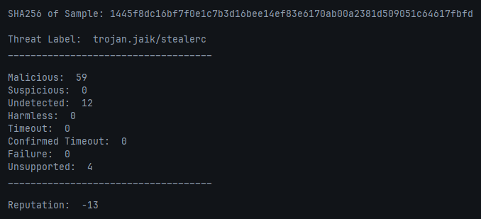

# VTScan
A GO CLI application that makes a call to the Virus Total API and pulls information regarding a specified SHA-256 hash

## Usage
- Export your VirusTotal API key to your environment variables:
    - Virus Totals website -> Click Profile -> API Key
    - Ex: `export VTAPIKEY="APIKEYHERE"` on Linux
- Run VTScan `./vtscan` and you will be prompted for the SHA-256 hash of the sample

